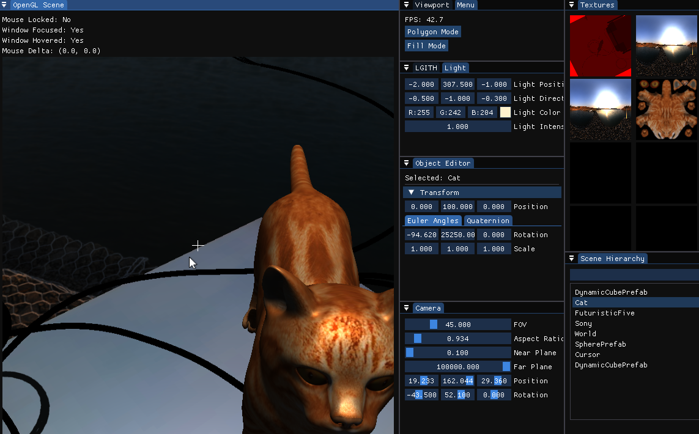

OpenGL Playground



A personal playground for experimenting with OpenGL and real-time graphics techniques. Current features include:

- PhysX-powered basic cube and sphere collision physics
- 3D model loading using Assimp
- Shadow mapping implementation
- Modern OpenGL rendering pipeline
- Immediate-mode UI with ImGui

**Acknowledgements**: Special thanks to [LearnOpenGL](https://learnopengl.com) for their tutorials.


## 🔧 Building the Project with CMake and vcpkg

This project uses [CMake](https://cmake.org/) for building and [vcpkg](https://github.com/microsoft/vcpkg) for dependency management.

### ✅ Dependencies (managed by vcpkg)

The following libraries are used:

* [GLFW](https://www.glfw.org/)
* [GLM](https://github.com/g-truc/glm)
* [GLAD](https://glad.dav1d.de/)
* [ImGui](https://github.com/ocornut/imgui) (with `glfw-binding`, `opengl3-binding`, and `docking-experimental`)
* [PhysX SDK](https://github.com/NVIDIA/PhysX)
* [Assimp](https://github.com/assimp/assimp)
* [nlohmann/json](https://github.com/nlohmann/json)


### ⚙️ Building with CMake

Create a build directory and run CMake:

```bash
mkdir build
cd build

cmake .. -DCMAKE_TOOLCHAIN_FILE=path/to/vcpkg/scripts/buildsystems/vcpkg.cmake
cmake --build .
```

For Visual Studio users:

```bash
cmake .. -A x64 -DCMAKE_TOOLCHAIN_FILE=path/to/vcpkg/scripts/buildsystems/vcpkg.cmake
```

